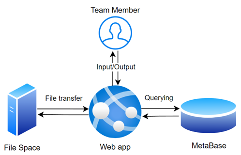

> ⚠️ **Warning:** this project is still in a developmental stage. Some sections of the code and documentation may be incomplete.

# Dolphin Acoustics VIP Database Management System

The Database Management System (DBMS) is a project that aims to streamline the data pipeline of the Dolphin Acoustics Vertically Integrated Project at the University of St Andrews (the Project).

The ensuing documentation details the installation and structure of the code written for the DBMS.

Familiarity with the data pipeline and implementation strategy found in the April 2024 DBMS handover document are required. General computer science competency, as well as more specific familiarity with the [requirements](#requirements) are also prerequesite.

## Requirements

The Web App has been developed on, and for, a Lunix based system (Debian 12). It is recommended to continue development on a Linux machine, whether physical or virtual. Listed below are dependencies of the DBMS:

- Python 3.10.12 (Linux) from [here](https://www.python.org/downloads/release/python-31012/)
- All Python libraries in [requirements.txt](requirements.txt)
- MariaDB 11.3.2 from [here](https://mariadb.org/download/?t=mariadb&p=mariadb&r=11.3.2&os=windows&cpu=x86_64&pkg=msi&mirror=heanet-ltd)

## Project description
The DBMS was developed to store data with its metadata in a homogenised system that could be easily interacted with by members of the Project (the Team). Certain functionalities of the DBMS include:
- storage of raw audio recordings (wav)
- storage of selections of the recordings (wav)
- storage of aggregate selection tables (csv)
- storage of contours of the selections (csv)
- Storage of aggregate contour statistics (csv)
- export of contour files in a different format (ctr)
- quality assurance at each stage of the pipeline
> **Note:** not all functionalities listed above have been implemented. In addition, the list above is neither detailed nor exhaustive. For a live record of all feature requests, please view the GitHub issues page. For more detail  on the design of each of these stages, please view the DBMS April 2024 handover document.

The storage of such data was split into two separate streams which were then managed by a Web App:
- storing file metadata in a database (the Meta Base)
- storing the files themselves in a file heirarchy (the File Space)

*High level data flow diagram of the DBMS*

## Structure and setup
> ⚠️ **Warning** development must be completed on a native linux system or linux subsystem.

This repository includes all code pertaining to the Web App. Instructions exist below for setting up the python virtual environment to successfully run the Web App, as well as initialising the Meta Base and File Space so it can run in tandem with the Web App.

### Initialising the Meta Base
> Please consult MariaDB documentation for instructions on how to complete the the following actions.

The Meta Base uses MariaDB as its server technology, which needs to be installed on a Linux machine or virtual machine before the Web App can be run successfully (see [dependencies](#dependencies)).

Once downloaded, the Meta Base may be initialised and a new database created. The database must then be populated by running the script in [create_database.sql](create_database.sql).

### Creating the virtual development environment
The Web App was developed using an array of libraries defined [above](#requirements). To create a virtual environment and install all the required libraries, the following code must be run in the Web App root folder:

`python3 virtualenv venv && venv/bin/pip install -r requirements.txt`

From the root folder, the virtual environment can then be started using the following command:

 `source venv/bin/activate`

> ⚠️ **Warning:** to prevent clutter on the git repository, please ensure the virtual environment folder name is placed in the [gitignore](.gitignore) file.

### Setting up the File Space
The File Space is simply a designated path on the file system of the server (the machine running the Web App). To set this folder, insert the relative or absolute path into [file_space_path.txt](file_space_path.txt) in the program root. For testing purposes it is recommended to use a relative path such as `filespace` as the File Space.

### Connecting the Web App to the Meta Base
The python script [db.py](db.py) handles all database connection. For security reasons, all database connection parameters are stored in global environment variables. 

The following are the variables that must be set:
- `STADOLPHINACOUSTICS_HOST` to set the host of the database (usually `localhost` for development environment)
- `STADOLPHINACOUSTICS_USER` to set the user of the database (usually `root` for development environment)
- `STADOLPHINACOUSTICS_PASSWORD` to set the password of the database (must be set in the MariaDB shell)
- `STADOLPHINACOUSTICS_DATABASE` to set the name of the database (must be created in the MariaDB shell)

While it is recommended to set these variables manually, [set_os_variables.py](set_os_variables.py) was written to set them automatically. Please read and understand the code beforehand and use with caution.

The password for a particular host and user can be set using the following command:

`ALTER USER '<user>'@'<host>' IDENTIFIED BY '<password>';
`

### Other setup instructions
If Google Maps are desired to view encounter coordinates, a Maps Embed API key is required to be placed in [google_api_key.txt](google_api_key.txt) in the program root. See [here](https://developers.google.com/maps/documentation/embed/get-api-key) for more details.

To start the server, run [app.py](app.py) from within the Python virtual environment from the root directory.

## The Meta Base
The metadata for each file is stored in a MariaDB database, otherwise called the Meta Base. See [Initialising the Meta Base](#initialising-the-meta-base).

The Meta Base currently models most data from the point of an audio recording to storing selections. An entity relationship diagram for the current Meta Base is shown below, where each entity contains attributes and foreign key references to other tables.

Each tuple in all tables are given a Universally Unique Identifier ([UUID](https://www.cockroachlabs.com/blog/what-is-a-uuid/)) such that foreign key references are simpler to implement. Additional unique and nullity constraints are also enforced on each table to standardise data quality assurance (please see [create_database.sql](create_database.sql) for more information).

The following subsections describe the tables from the ER diagram in more detail.

#### Encounter
Stores information on a marine animal encounter. Categorical information is stored using foreign keys to separate tables (*species*, *data_source*, and *recording_platform*) while other information in attributes.

#### File
Stores general metadata on a file stored in the File Space, such as the filename, extension, and upload date. Each file is given a unique UUID that is referenced by other entities that require file storage.

#### Recording
Stores information on each recording in an encounter. Intuitively, each *recording* references an *encounter* (many-to-one). 

#### Selection
Stores a particular selection (otherwise known as clip) from a recording. Intuitively, each *selection* references a *recording*.

## The File Space
All data files stored by the user in the DBMS are placed in the File Space. The File Space should already be initialised [above](#setting-up-the-file-space).

> ⚠️ **Warning:** the File Space should rarely be manually modified by the Developer and never by the User. This is because changing file paths would invalidate the file references in the Meta Base.

An important aspect of the File Space is its heirarchical structure, and the fact that can be understood by the user. Namely, when a file is added to the DBMS, it is placed in an intuitive location within the File Space. With read-only permissions, a user could then access files without using the Web App as an intermediary.

The structure of the file space is shown below, notingt that the contour WAV file is not yet developed in the DBMS. 

*The File Space shown in a diagramattic form. Note that the naming conventions are for demonstration purposes only and do not accurately reflect the implementation of the File Space*

## The Web App
The Web App brings together the Meta Base and the File Space into a single user interface. The Web App utilises the Flask library.

The following folders exist in the Web App's root directory (note that a *module* refers to a compartamentalised section of code pertaining to a specific functionality such as encounter, recording or selection):
- [resources](resources) contains additional files required in the Web App such as images.
- [routes](routes) contains all the Flask route blueprints for separate modules.
- [static](static) contains all CSS scripts used in the user interface.
- [templates](templates) contains all HTML scripts used in the user interface.
- [db.py](db.py) handles database connection and the loading of external files such as [file_space_path.txt](file_space_path.txt) and [google_api_key.txt](google_api_key.txt).
- [app.py](app.py) is the mainline which calls `db.py` and loads all `routes`.

### Templates and static files
Templates are pre-designed layouts that arrange content on a webpage, usually written in HTML. Found in the `templates` folder, templates are structured into modular sub-categories for set functions.

The template [templates/partials/header.html]() defines a reusable header at the top of each page.

Styling (or CSS) files are stored in the `static` folder. These files are referenced in each of the templates through a resource route specified in [app.py](app.py).

### Routes
Routes are a server-side URL schema which describe interfaces through which a client can interact with a web app. Routes follow a Hypertext Transfer Protocol (HTTP) through which requests such as `GET` and `POST` can be made. Any request sent to the server that matches a defined URL schema is handed to the associated method defined in [routes](). 

> The majority of routes exist in the folder [routes](), however the mainline [app.py]() also contains some basic routes such as `/home` and `/`, where the latter redirects to the prior.

#### Requests
HTTP has a large number of possible request types. For simplicity, the Web App uses:
- `GET` to load templates and/or send information to the client;
- `POST` to send information from the client to the server, usually to complete a CRUD operation in the Meta Base.

### Object relational mapping
When interacting with the Meta Base, an object relational mapping (ORM) is implemented. This allows all the database relations to be lazily and effortlessly loaded in a familiar object-oriented structure in Python.

The classes for each relation are written in [models.py](models.py) using the [Flask-SQLAlchemy](https://flask-sqlalchemy.palletsprojects.com/en/3.1.x/). This library offers seamless integration with the Flask library, that used to create the Web App. The structure of each model closely matches the Meta Base schema. 

Additional methods also exist within each ORM class as to provide APIs for the program to interact with the database, such as:

#### `update_call()` 
This method is a generic method that could be used to implement clean-up or quality-assurance checks. In addition, calling the `update_call()` method in a master would subsequently call `update_call()` in all its slaves. 

> An example of the update_call method being used is when metadata of a *species* is changed. Each *encounter*, *recording*, and *selection* that are slave to that *species* would have their own `update_call()` methods added to the call stack. Functionality written in these methods would then update the files in the File Space to include the updated species data.

#### `delete()`
This method prevents foreign key error references upon delete. Upon the deletion request of a master object (by calling `delete()` in the master), the  `delete()` method in each slave is added to the call stack, which ensures all slaves are removed from the database before a master.

> ⚠️ **Warning:** cascading delete is dangerous, and where it is implemented the user should always be warned before execution.

### Session handling
As data must be synchronised between the File Space and Meta Base, atomicity is crucial. An atomic database transaction is one where either all required operations occur or none at all.

To implement atomicity in the Web App, all database operations are bundled into sessions. If an error is produced in interacting with the File Space, any metadata changes pertaining to the request are rolled back. 