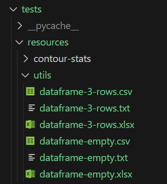

> ⚠️ **Warning:** this project is still in a developmental stage. Some sections of the code and documentation may be incomplete.


# Dolphin Acoustics VIP Database Management System

The Database Management System (DBMS) is a project that aims to streamline the data pipeline of the Dolphin Acoustics Vertically Integrated Project at the University of St Andrews.

The ensuing documentation details the [installation](#installation) and [operation](#maintaining-and-operating-the-web-app) of the code.

Familiarity with the data pipeline and implementation strategy found in the Project's GitHub Wiki are required. General computer science competency, as well as more specific familiarity with the [requirements](#requirements) are also prerequesite.

<a name="requirements"></a>
<a name="dependencies" depracated></a>
## Requirements

This section lists software and hardware requirements for the operation of the Program.

The Program has been developed on and for, a Linux based system running Debian 12. Further development, testing and production are to be done on the same (or similar) type system.

- Python 3.10.12 from [here](https://www.python.org/downloads/release/python-31012/)
- All Python libraries in [requirements.txt](requirements.txt)
- MariaDB 10.5.23 from [here](https://mariadb.org/download/?t=mariadb&o=true&p=mariadb&r=10.5.23&os=Linux&cpu=x86_64&i=systemd&mirror=archive) (restricted by production environment)

## Project description
The Program was developed to store data with its metadata in a homogenised system. The following are outlined a list of some features (a more comprehensive list is to be found on the GitHub Wiki):
- Storage of raw audio recordings (wav)
- Storage of selections of the recordings (wav)
- Storage of aggregate selection tables (csv)
- Storage of contours of the selections (csv)
- Storage of aggregate contour statistics (csv)
- Export of contour files in a different format (ctr)
- Quality assurance at each stage of the pipeline

Files and their metadata are stored in two separate locations: the Filespace and Database respectively. The Web App was then created to maintain data integrity between the two, and provide an interface for users.


*High level data flow diagram of the DBMS*

## Installation
> ⚠️ **Warning** make sure you have read and understood the [requirements](#requirements) before continuing.

The [repository](/) of which this document is a part includes all code pertaining to the Program. The following steps are required whether the Program is in development or production, and must be followed closely to ensure a seamless installation:

1. [Create a virtual environment](#creating-a-virtual-development-environment)
2. [Create and link the Database](#creating-and-linking-the-database)
3. [Create and link the Filespace](#creating-and-linking-the-filespace)
4. [Start the Web App](#starting-the-web-app)

### Creating a Virtual Development Environment
The Program was developed using an array of libraries installed using the package installer for Python ([pip](https://pip.pypa.io/en/latest/)). It is recommended whether developing or in production to install all requirements in [requirements.txt](requirements.txt) in a [virtual environment](https://docs.python.org/3/library/venv.html).

**Commands to create and run the virtual environment**

```
python3 -m venv virtualenv
source virtualenv/bin/activate
pip3 install -r requirements.txt
```

**Command to create the requirements text file**

 If you make changes to the library and want to generate a new [requirements.txt](requirements.txt) file, open the virtual environment and run the following command:

 `pip3 freeze > requirements.txt`

### Creating and Linking the Database

>Note: the following section assumes the existence of a local (for development and testing) or external (for production) MariaDB instance.

To create the database, open a MariaDB shell and run the DDL script [create_database.sql](create_database.sql). This will create all empty tables apart from a single administrator user which can be used to log into the Web App initially.

The database connection is made in [database_handler.py](database_handler.py), however configuration for the database is made in [config.py](config.py). Here exist three different profiles. In [main.py](main.py), the profile can be changed by changing the argument passed in the mainline:

```
if __name__ == '__main__':
    # For development configuration
    app = create_app('config.DevelopmentConfig')
    # For testing configuration
    app = create_app('config.TestingConfig')
    # For production configuration
    app = create_app('config.ProductionConfig')
    if app is None:
        logger.fatal('Exiting program...')
        exit(1)
    logger.info('Starting application')
    app.run()
```

Each configuration required different global environment variables to be set to ensure an operational database connection.


#### Configuring the Development Database

Set the following global environment variables:
- `DEV_STADOLPHINACOUSTICS_HOST` to set the host of the database (usually `localhost` for development environment)
- `DEV_STADOLPHINACOUSTICS_USER` to set the user of the database (usually `root` for development environment)
- `DEV_STADOLPHINACOUSTICS_PASSWORD` to set the password of the database
- `DEV_STADOLPHINACOUSTICS_DATABASE` to set the name of the database

#### Configuring the Testing Database

Set the following global environment variables:
- `TESTING_STADOLPHINACOUSTICS_HOST` to set the host of the database (usually `localhost` for the test environment)
- `TESTING_STADOLPHINACOUSTICS_USER` to set the user of the database (usually `root` for the test environment)
- `TESTING_STADOLPHINACOUSTICS_PASSWORD` to set the password of the database
- `TESTING_STADOLPHINACOUSTICS_DATABASE` to set the name of the database

#### Configuring the Production Database

Set the following global environment variables:
- `PROD_STADOLPHINACOUSTICS_HOST` to set the host of the database
- `PROD_STADOLPHINACOUSTICS_USER` to set the user of the database
- `PROD_STADOLPHINACOUSTICS_PASSWORD` to set the password of the database
- `PROD_STADOLPHINACOUSTICS_DATABASE` to set the name of the database

### Creating and Linking the Filespace
The File Space is simply a designated path on the server system. To set this folder, insert the relative or absolute path into [file_space_path.txt](file_space_path.txt) in the program root.

Note that by default the path in [file_space_path.txt](file_space_path.txt) is relative, however should you enter an absolute path (for example one beginning with `C:`), this will automatically be recognised.

No folders or files need to be inserted in the Filespace. However the Filespace folder itself must exist in the system before operating the Web App.

### Starting the Web App

To start the Web App on the server, activate the [Virtual Environment](#creating-a-virtual-development-environment) and run [main.py](main.py) from the root directory. No parameters are required. If all steps prior were completed satisfactorily the Flask application will run successfully. 

>Note: if the Flask start-up message includes `Debug mode: on`, this likely means the program is being run in development or testing configuration.

## Maintaining and Operating the Web App
The Web App brings together the Meta Base and the File Space into a single user interface. The Web App utilises the Flask library.

The following folders exist in the Web App's root directory (note that a *module* refers to a compartamentalised section of code pertaining to a specific functionality such as encounter, recording or selection):
- [resources](resources) contains additional files required in the Web App such as images
- [routes](routes) contains all the Flask route blueprints for separate modules
- [static](static) contains all CSS scripts and Javascript code used in the user interface
- [templates](templates) contains all HTML scripts used in the user interface
- [logs](logs) contains all logging files automatically generated

The following files exist outside the aforementioned folders:
- [main.py](main.py) runs the Web App
- [config.py](config.py) sets Flask environment variables for a development, testing or production environment
- [database_handler.py](database_handler.py) initialises the database and SQLAlchemy ORM model provides APIs for custom database interaction
- [models.py](models.py) contains all SQLAlchemy ORM database classes
- [logger.py](models.py) handles the setup of a logger
- [exception_handler.py](exception_handler.py) defines custom exceptions and contains methods to handle them
- [contour_statistics.py](contour_statistics.py) completes all contour stats calculations
- [maintenance.py](maintenance.py) is another flask app that can be called whenever the main application needs to be taken down for maintenance
- [test.py](test.py) contains automated tests for the Web App

## Templates and Static Files
Templates are layouts that arrange content on a webpage, usually written in HTML. Found in the `templates` folder, templates are structured into modular sub-categories for set functions.

The template [templates/partials](/templates/partials/) folder has a number of modular templates which are used multiple times in other HTML code.

Styling (or CSS) and Javascript files are stored in the [static/css](/static/css) and [static/js](/static/js/) folders respectively. The files in these folders are loaded in templates by the [header.html](/templates/partials/header.html) module which is shown on each page. 

## Routes
Routes are a server-side URL schema which describe interfaces through which a client can interact with a web app. Routes follow a Hypertext Transfer Protocol (HTTP) through which requests such as `GET`, `POST` and `DELETE` can be made. 

Any request sent to the server that matches a defined URL schema is handed to the associated method defined in [routes](/routes/). All routes are brought together in [main.py](main.py).

Routes are intuitively modularised by function (a general rule of thumb is that a particular section of the user interface will interact with routes from just a single module).

> For example: viewing, adding, updating and removing recordings is done through routes in [routes_recording.py](/routes/routes_recording.py).

### Object Relational Mapping
When interacting with the Meta Base, an object relational mapping (ORM) is implemented. This allows all the database relations to be lazily and effortlessly loaded in a familiar object-oriented structure in Python.

The classes for each relation are written in [models.py](models.py) using the [Flask-SQLAlchemy](https://flask-sqlalchemy.palletsprojects.com/en/3.1.x/). This library offers seamless integration with the Flask library, that used to create the Web App. The structure of each model closely matches the Meta Base schema. 

### Version History

In the database creation script, you will notice a command used on all but the file and user tables: `WITH VERSION HISTORY`. This is a feature of MariaDB meaning a snapshot of the database can be viewed at any point in time since its creation. 

This requires complex queries that cannot be completed in the SQLAlchemy ORM model. Therefore, [database_handler.py](database_handler.py) contains methods used throughout the program to query the database in a snapshot state. This is called Archive Mode and is implemented through storing `snapshot_date` in the session cookies (more can be read on Archive Mode in the GitHub Wiki).

### Session handling
As data must be synchronised between the File Space and Meta Base, atomicity is crucial. An atomic database transaction is one where either all required operations occur or none at all.

To implement atomicity in the Web App, all database operations are bundled into sessions. If an error is produced in interacting with the File Space, any metadata changes pertaining to the request are rolled back. 

To prevent orphaned files from appearing in the database, all database changes are flushed (`flush()`) before any files are moved. This way, any issues appearing due to the flush are caught and handled (or passed to the user) before creating irreversible file changes.

# Data Model

## Overview

The data is stored in a MariaDB database using SQLAlchemy. Each table is represented by a class in Python, defined in [models.py](../models.py). 

## Unique IDs

Most tables use unique IDs as primary keys, generated using MariaDB's UUID() method. This creates a 36-character string in the format `XXXXXXXX-XXXX-XXXX-XXXX-XXXXXXXXXXXX`. Unique constraints are also defined separately on specific attributes to ensure data integrity.

## File Storage

> ⚠️ **Warning:** the File Space should rarely be manually modified by the Developer and never by the User. This is because changing file paths would invalidate the file references in the Meta Base.


*The File Space shown in a diagramattic form. Note that the naming conventions are for demonstration purposes only and do not accurately reflect the implementation of the File Space*

Files are stored in unique paths, with each file represented by a `File` class object. All data files stored by the user in the DBMS are placed in the File Space. The File Space should already be initialised [above](#setting-up-the-file-space). The following techniques are used for file storage:

### Creating a Unique Path

When a file needs to be saved, a new `File` object is created and referenced as a foreign key in its parent class. The parent class provides the path (directory and filename) to the `File` object. This ensures that each file is associated with a specific parent object and can be easily retrieved.

* Filenames are generated using methods in the parent class. This allows for consistent naming conventions and ensures that filenames are unique within a given directory.
* Directories are generated using methods in the parent class. This allows for a hierarchical organization of files and ensures that files are stored in a logical and consistent manner.

The directory and filename are then passed to the `File` object using `insert_path_and_filename()`. This method updates the `File` object with the generated path and filename, ensuring that the file is stored in the correct location.

### Changing Paths

When metadata changes, the file location must be updated to reflect the new metadata. The `Encounter`, `Recording`, and `Selection` classes are responsible for updating their file locations using the `update_call()` method.

* The `update_call()` method is called when metadata changes, such as when the `Encounter` name is updated.
* The `update_call()` method calls the `move_file()` method in child `File` objects, which updates the file location to reflect the new metadata.

This ensures that files are always stored in a location that reflects the current metadata, and that files can be easily retrieved using the updated metadata.

### Handling Duplicate Files

If a file already exists in the target path, the existing file is renamed using `File.rename_loose_file()`. This prefixes a unique ID to the existing file, allowing the file to be moved to the desired location.

>Note: This should never happen, as file paths are chosen to be unique alongside the database metadata. However, in the unlikely event that a duplicate file is detected, this mechanism ensures that the file is renamed and can be stored in the desired location. An error is written to the log in this case, indicating that a duplicate file was detected and renamed. This allows for easy identification and resolution of any issues related to duplicate files.

### Handling File Deletion

The `delete()` method prevents foreign key error references upon delete. Upon the deletion request of a master object (by calling `delete()` in the master), the  `delete()` method in each child is added to the call stack, which ensures all slaves are removed from the database before a master.

The `delete()` method in `Encounter`, `Recording`, and `Selection` are responsible for removing all their own files before returning to the master.

> ⚠️ **Warning:** cascading delete is dangerous, and where it is implemented the user should always be warned before execution.

## Testing
Testing is found in the [tests](/tests) folder. Python files exist there within the [pytest](https://docs.pytest.org/en/stable/) framework. Tests can be run with `python3 -m pytest tests` from the root directory.

The test environment is automatically created, and is effectively an instance of the Flask application. This means all setup instructions **MUST** be followed before running tests.

The following tests are included in the [tests](/tests) folder. Some require files to exist in the [tests/resources](/tests/resources) directory:

**Test Contour Stats**

[test_contour_stats.py](/tests/test_contour_stats.py) tests the calculation of contour statistics. The running of these tests requires a number of resources to exist in [tests/resources/contour-stats](/tests/resources/contour-stats/):
* A sub-folder prefixed with `test#` exactly (e.g., test1, test8, test15) should be made for each recording that is to be tested. 
* In this folder, a file, `RoccaContourStats.xlsx` (exactly) must exist with the expected values of the contour statistics calculations.
* Any number of CSV contour files must exist, prefixed with `sel_#` exactly (e.g., sel_1, sel_01, sel_10, sel_100). 
* A column in `RoccaContourStats.xlsx` must be made, `SelectionNumber` with the same integer value that is used in the previous step to name the CSV contour files. The test will fail if there exist CSV files without a respective row in `RoccaContourStats.xslx`

An example of this setup is shown here:


**Test Encounter**

[tests/test_encounter.py](/tests/test_encounter.py) tests the Encounter class in [models.py](/models.py). 

**Test Errors**

[tests/test_errors.py](/tests/test_errors.py) tests methods and classes in [exception_handler.py](/exception_handler.py).

**Test Recording**

[tests/test_recording.py](/tests/test_recording.py) tests the Recording class in [models.py](/models.py).

**Test Restricted Routes**

[tests/test_restricted_routes.py](/tests/test_restricted_routes.py) tests whether access is forbidden to the required routes for users without certain access permissions.

**Test Utils**

[tests/test_utils.py](/tests/test_utils.py) tests a number of general utilities classes stored in [utils.py](/utils.py). 

Certain tests (testing the reading of CSV, TSV and XLSX files into Pandas) require the following files to exist in [tests/resources/utils](/tests/resources/utils/):
* `dataframe-3-rows.csv` a CSV file with 3 data rows (any number of columns allowed).
* `dataframe-3-rows.txt` a TSV file with 3 data rows (any number of columns allowed).
* `dataframe-3-rows.xlsx` an Excel file with 3 data rows (any number of columns allowed).
* `dataframe-empty.csv` a CSV file with no rows.
* `dataframe-empty.txt` a TSV file with no rows.
* `dataframe-empty.xlsx` an Excel file with no rows.

This should look like:
